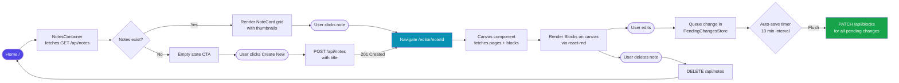
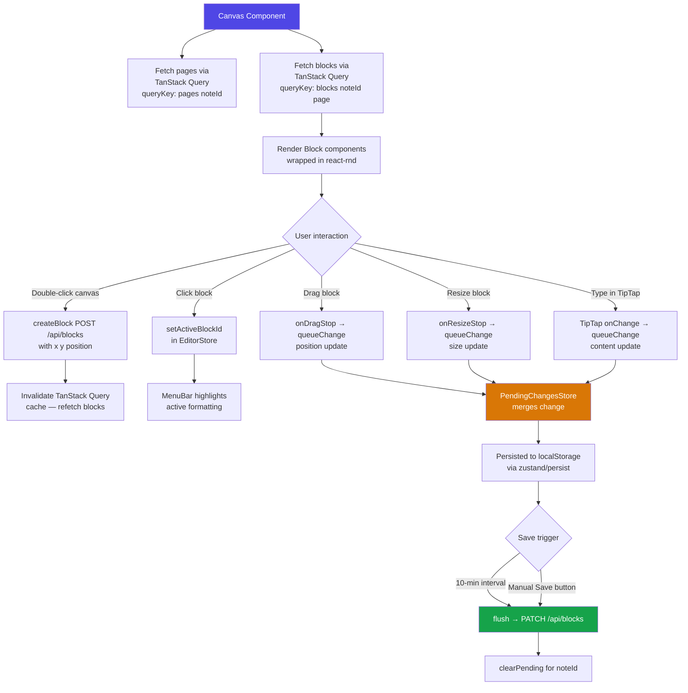
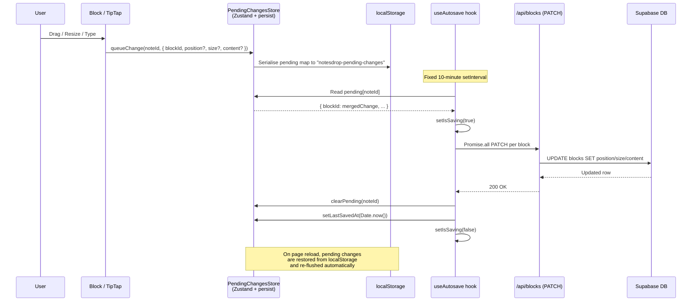
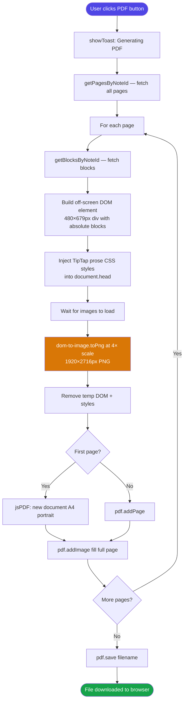
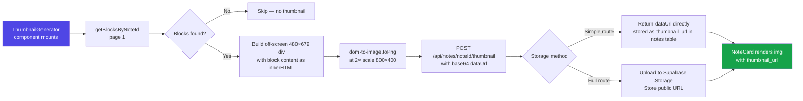

# NotesDrop

> A modern, canvas-based note-taking application where every idea lives freely on an infinite, paginated canvas — built with Next.js 15, TipTap, Supabase, and Zustand.

---

## Table of Contents

- [Overview](#overview)
- [Live Demo & Screenshots](#live-demo--screenshots)
- [Tech Stack](#tech-stack)
- [Architecture Overview](#architecture-overview)
- [Application Flow](#application-flow)
  - [Authentication Flow](#authentication-flow)
  - [Note Lifecycle Flow](#note-lifecycle-flow)
  - [Editor & Block Editing Flow](#editor--block-editing-flow)
  - [Autosave & Persistence Flow](#autosave--persistence-flow)
  - [PDF Export Flow](#pdf-export-flow)
  - [Thumbnail Generation Flow](#thumbnail-generation-flow)
- [Data Model](#data-model)
- [Project Structure](#project-structure)
- [API Reference](#api-reference)
- [State Management](#state-management)
- [Getting Started](#getting-started)
- [Database Setup](#database-setup)
- [Environment Variables](#environment-variables)
- [Available Scripts](#available-scripts)
- [Contributing](#contributing)
- [License](#license)

---

## Overview

NotesDrop reimagines note-taking as a **spatial, canvas-first experience**. Instead of a single linear document, each note is composed of freely positioned, resizable **content blocks** arranged on an A4-proportioned canvas. Notes can span multiple pages, be exported to PDF, and are secured per-user with Supabase Row Level Security.

### Key Differentiators

| Feature | Description |
|---|---|
| Canvas Blocks | Every note is made of drag-and-drop, resizable rich-text blocks |
| Multi-page | Notes support multiple canvas pages with tab navigation |
| Offline-resilient saves | Pending changes are persisted in `localStorage` and flushed on a timer or manual trigger |
| TipTap rich text | Full markdown-style formatting inside every block |
| PDF export | Single-page or all-pages export at 4× resolution |
| Auto-thumbnails | Visual preview snapshots generated from the first canvas page |
| Auth | Email/password + Google OAuth via Supabase Auth |

---

## Tech Stack

### Frontend

| Library | Version | Role |
|---|---|---|
| [Next.js](https://nextjs.org/) | 15.3.8 | React framework — App Router, Server Actions, API routes |
| [React](https://react.dev/) | 19.x | UI runtime with concurrent features |
| [TypeScript](https://www.typescriptlang.org/) | 5.x | Static typing across the entire codebase |
| [Tailwind CSS](https://tailwindcss.com/) | 4.x | Utility-first styling with `@tailwindcss/typography` |
| [TipTap](https://tiptap.dev/) | 2.x | Headless rich-text editor (ProseMirror-based) |
| [react-rnd](https://github.com/bokuweb/react-rnd) | 10.x | Drag-and-resize primitive for canvas blocks |
| [Zustand](https://zustand-demo.pmnd.rs/) | 5.x | Lightweight global state (editor state + pending changes) |
| [TanStack Query](https://tanstack.com/query) | 5.x | Server state — data fetching, caching, invalidation |
| [Radix UI](https://www.radix-ui.com/) | latest | Accessible headless primitives (Select, Label, Slot) |
| [Lucide React](https://lucide.dev/) | 0.517 | Icon set |
| [date-fns](https://date-fns.org/) | 4.x | Date formatting utilities |
| [Zod](https://zod.dev/) | 3.x | Runtime schema validation for API payloads |

### Backend & Infrastructure

| Service | Role |
|---|---|
| [Supabase](https://supabase.com/) | PostgreSQL database, Auth, Row Level Security |
| [Supabase SSR](https://supabase.com/docs/guides/auth/server-side/nextjs) | Cookie-based session management for Next.js |
| [Next.js API Routes](https://nextjs.org/docs/app/building-your-application/routing/route-handlers) | REST API layer (`/api/notes`, `/api/blocks`, `/api/pages`) |

### Export & Rendering

| Library | Role |
|---|---|
| [dom-to-image](https://github.com/tsayen/dom-to-image) | Rasterises DOM elements to PNG at 4× scale |
| [jsPDF](https://github.com/parallax/jsPDF) | Composes rasterised pages into a downloadable PDF |
| [lowlight](https://github.com/wooorm/lowlight) + [highlight.js](https://highlightjs.org/) | Syntax highlighting inside TipTap code blocks |

### Build & Tooling

| Tool | Role |
|---|---|
| [Turbopack](https://turbo.build/pack) | Dev-server bundler (via `next dev --turbopack`) |
| [ESLint](https://eslint.org/) | Code linting (`eslint-config-next`) |
| [PostCSS](https://postcss.org/) | CSS processing for Tailwind |

---

## Architecture Overview

```
┌─────────────────────────────────────────────────────────────────┐
│                          Browser (Client)                        │
│                                                                  │
│  ┌──────────────┐    ┌───────────────────────────────────────┐  │
│  │  Next.js     │    │          React Application            │  │
│  │  Pages/RSC   │    │                                       │  │
│  │              │    │  ┌─────────────┐  ┌────────────────┐  │  │
│  │  / (home)    │    │  │ TanStack    │  │   Zustand      │  │  │
│  │  /editor/    │    │  │ Query Cache │  │  ┌──────────┐  │  │  │
│  │  /login      │    │  │             │  │  │ Editor   │  │  │  │
│  │  /signup     │    │  └──────┬──────┘  │  │ Store    │  │  │  │
│  └──────────────┘    │         │          │  └──────────┘  │  │  │
│                      │  ┌──────▼──────┐  │  ┌──────────┐  │  │  │
│                      │  │  lib/api/   │  │  │ Pending  │  │  │  │
│                      │  │  (fetch)    │  │  │ Changes  │  │  │  │
│                      │  └──────┬──────┘  │  │ Store    │  │  │  │
│                      │         │          │  └──────────┘  │  │  │
│                      └─────────┼──────────┴────────────────┘  │  │
│                                │                               │  │
└────────────────────────────────┼───────────────────────────────┘  
                                 │ HTTP (REST)
                ┌────────────────▼────────────────┐
                │       Next.js API Routes         │
                │                                  │
                │  POST/GET/PATCH/DELETE            │
                │  /api/notes                      │
                │  /api/blocks                     │
                │  /api/pages                      │
                │  /api/notes/[id]/thumbnail       │
                └────────────────┬────────────────┘
                                 │ Supabase JS SDK
                ┌────────────────▼────────────────┐
                │            Supabase              │
                │                                  │
                │  ┌────────────────────────────┐  │
                │  │      PostgreSQL DB          │  │
                │  │  notes / blocks / pages     │  │
                │  │  Row Level Security (RLS)   │  │
                │  └────────────────────────────┘  │
                │  ┌────────────────────────────┐  │
                │  │      Supabase Auth          │  │
                │  │  Email/Password + Google    │  │
                │  │  OAuth  JWT Sessions        │  │
                │  └────────────────────────────┘  │
                └─────────────────────────────────┘
```

---

## Application Flow

### Authentication Flow

```mermaid
flowchart TD
    A([Browser Request]) --> B{Middleware\nupdateSession}
    B -->|Valid Session| C[Serve Page]
    B -->|No Session| D{Route type?}
    D -->|Public route| C
    D -->|Protected route| E[Redirect /login]

    E --> F{Login Method}
    F -->|Email + Password| G[Server Action: login\nsupabase.auth.signInWithPassword]
    F -->|Google OAuth| H[Server Action: signInWithGoogle\nsupabase.auth.signInWithOAuth]

    G -->|Success| I[revalidatePath / redirect home]
    G -->|Failure| J[redirect /error]

    H --> K[OAuth redirect to Google]
    K -->|Callback| L[/auth/callback route\nExchange code for session]
    L --> I

    style A fill:#4f46e5,color:#fff
    style I fill:#16a34a,color:#fff
    style J fill:#dc2626,color:#fff
```

The middleware runs on **every request** (except static assets). It calls Supabase's `updateSession` which refreshes the JWT if needed and sets the session cookie. Server Actions (`login`, `signup`, `signout`, `signInWithGoogle`) live in `lib/auth-actions.ts` and run exclusively on the server.

---

### Note Lifecycle Flow



---

### Editor & Block Editing Flow



**Block coordinate system:** The canvas is a fixed `480 × 679 px` div (exact A4 proportions). Each block stores `position.x`, `position.y`, `size.width`, `size.height` in pixels, enabling pixel-perfect PDF export.

---

### Autosave & Persistence Flow



The `PendingChangesStore` uses Zustand's `persist` middleware — only the `pending` map is serialised (not `isSaving` / `lastSavedAt`). This means **unsaved changes survive page refreshes**.

---

### PDF Export Flow



The 4× super-sampling (`dom-to-image` with `scale(4)` CSS transform on a 1920×2716 pixel canvas) ensures text and images render crisply at 300 DPI equivalent when printed.

---

### Thumbnail Generation Flow



---

## Data Model

### Entity Relationship Diagram

```
┌─────────────────────────────┐
│          auth.users          │   (Supabase Auth — managed)
│─────────────────────────────│
│  id            UUID PK       │
│  email         TEXT          │
│  raw_user_meta full_name     │
└───────────────┬─────────────┘
                │ 1
                │ has many
                │ N
┌───────────────▼─────────────┐
│            notes             │
│─────────────────────────────│
│  id               UUID PK   │
│  title            TEXT NN   │
│  user_id          UUID FK   │──── auth.users.id (CASCADE DELETE)
│  created_at       TIMESTAMPTZ│
│  updated_at       TIMESTAMPTZ│  ← auto-updated via trigger
│  thumbnail_url    TEXT       │
│  thumbnail_updated_at TIMESTAMPTZ│
└──────┬──────────────┬────────┘
       │              │
       │ 1            │ 1
       │ has many     │ has many
       │ N            │ N
┌──────▼──────┐  ┌───▼──────────────────────────┐
│    pages    │  │            blocks             │
│─────────────│  │───────────────────────────────│
│ id   UUID PK│  │ id         UUID PK            │
│ note_id UUID│  │ note_id    UUID FK → notes.id  │
│ page_number │  │ page_number INT DEFAULT 1      │
│ created_at  │  │ content    JSONB { text: HTML }│
│ updated_at  │  │ position   JSONB { x, y }     │
│ UNIQUE      │  │ size       JSONB { w, h }     │
│ (note_id,   │  │ created_at TIMESTAMPTZ        │
│  page_number│  │ updated_at TIMESTAMPTZ        │
└─────────────┘  └───────────────────────────────┘
```

### Column Details

#### `notes`

| Column | Type | Notes |
|---|---|---|
| `id` | `UUID` | `gen_random_uuid()` — primary key |
| `title` | `TEXT NOT NULL` | Display name, editable inline |
| `user_id` | `UUID` | FK → `auth.users(id)` ON DELETE CASCADE |
| `thumbnail_url` | `TEXT` | Base64 data URL or Supabase Storage URL |
| `thumbnail_updated_at` | `TIMESTAMPTZ` | Staleness check for re-generation |
| `created_at / updated_at` | `TIMESTAMPTZ` | Auto-managed by DB trigger |

#### `blocks`

| Column | Type | Notes |
|---|---|---|
| `id` | `UUID` | Primary key |
| `note_id` | `UUID` | FK → `notes(id)` ON DELETE CASCADE |
| `page_number` | `INT` | Canvas page this block belongs to |
| `content` | `JSONB` | `{ "text": "<html string from TipTap>" }` |
| `position` | `JSONB` | `{ "x": number, "y": number }` — pixels from top-left |
| `size` | `JSONB` | `{ "width": number, "height": number }` — in pixels |

#### `pages`

| Column | Type | Notes |
|---|---|---|
| `id` | `UUID` | Primary key |
| `note_id` | `UUID` | FK → `notes(id)` ON DELETE CASCADE |
| `page_number` | `INT` | 1-based index; unique per note |

---

## Project Structure

```
notesdrop-next/
│
├── app/                              # Next.js App Router root
│   ├── layout.tsx                    # Root layout (fonts, ReactQueryProvider, ToastProvider)
│   ├── page.tsx                      # Home — note grid
│   ├── loading.tsx                   # Root-level suspense skeleton
│   │
│   ├── (auth)/                       # Auth route group (no layout header)
│   │   ├── login/page.tsx            # Email/password + Google login form
│   │   ├── signup/page.tsx           # Registration form
│   │   ├── signup/confirm/page.tsx   # Email confirmation prompt
│   │   ├── logout/page.tsx           # Post-logout landing
│   │   └── auth/callback/route.ts    # OAuth code-exchange handler
│   │
│   ├── api/                          # Route Handlers (REST API)
│   │   ├── notes/
│   │   │   ├── route.ts              # GET · POST · PATCH · DELETE /api/notes
│   │   │   ├── [noteId]/
│   │   │   │   ├── thumbnail/route.ts         # POST — upload thumbnail to storage
│   │   │   │   └── thumbnail-simple/route.ts  # POST — store base64 directly in DB
│   │   │   └── generate-all-thumbnails/route.ts  # POST — batch re-generate
│   │   ├── blocks/route.ts           # GET · POST · PATCH · DELETE /api/blocks
│   │   └── pages/route.ts            # GET · POST · DELETE /api/pages
│   │
│   ├── components/                   # App-level shared components
│   │   ├── NoteCard.tsx              # Card with thumbnail, title, date
│   │   ├── NotesContainer.tsx        # Grid of NoteCards + create button
│   │   ├── NoteContainerHeader.tsx   # Header with user greeting + new-note dialog
│   │   └── ThumbnailGenerator.tsx    # Client component that triggers thumbnail gen
│   │
│   ├── editor/[noteId]/
│   │   ├── page.tsx                  # Editor shell layout
│   │   └── components/
│   │       ├── Canvas.tsx            # Infinite canvas — pages, zoom, block layout
│   │       ├── Block.tsx             # react-rnd wrapper for each content block
│   │       ├── TiptapEditor.tsx      # TipTap editor instance per block
│   │       ├── EditorMenuBar.tsx     # Formatting toolbar + save + PDF + delete
│   │       └── SelectHeading.tsx     # Heading-level dropdown (H1–H4)
│   │
│   ├── error/page.tsx                # Generic error boundary page
│   ├── debug-thumbnail/page.tsx      # Dev utility for testing thumbnail gen
│   └── provider/ReactQueryProvider.tsx  # TanStack Query client provider
│
├── components/
│   └── ui/                           # Radix-based design system components
│       ├── button.tsx                # CVA-powered Button
│       ├── card.tsx                  # Card primitive
│       ├── input.tsx                 # Input field
│       ├── label.tsx                 # Form label
│       ├── select.tsx                # Radix Select wrapper
│       ├── skeleton.tsx              # Loading skeleton
│       ├── Toast.tsx                 # Toast notification overlay
│       ├── LoginLogoutButton.tsx     # Context-aware auth button
│       ├── NotesContainerLoader.tsx  # Skeleton grid for notes loading state
│       └── UserGreetText.tsx         # Displays authenticated user's name
│
├── contexts/
│   └── ToastContext.tsx              # Global toast notification context + hook
│
├── hooks/
│   ├── useAutosave.ts                # 10-min interval flush + manual save
│   └── useActiveMark.ts             # TipTap mark/node active-state for toolbar
│
├── lib/
│   ├── auth-actions.ts               # Server Actions: login · signup · signout · OAuth
│   ├── pdf-utils.ts                  # downloadPageAsPDF / downloadAllPagesAsPDF
│   ├── thumbnail-utils.ts            # generateNoteThumbnail / generateThumbnailFromPage
│   ├── client-thumbnail-utils.ts     # Browser-side thumbnail upload helpers
│   ├── thumbnail-scheduler.ts        # Debounced thumbnail schedule logic
│   ├── tiptap-extension-config.ts    # Central TipTap extension configuration
│   ├── utils.ts                      # cn() Tailwind class merger
│   ├── api/
│   │   ├── blocks.ts                 # Client fetch wrappers for /api/blocks
│   │   ├── notes.ts                  # Client fetch wrappers for /api/notes
│   │   ├── pages.ts                  # Client fetch wrappers for /api/pages
│   │   └── thumbnails.ts             # Client fetch wrappers for thumbnail endpoints
│   └── validators/
│       ├── blocks.ts                 # Zod schemas: insert · update · delete block
│       └── notes.ts                  # Zod schemas: insert · update · delete note
│
├── store/
│   ├── useEditroStore.ts             # activeEditor · activeBlockId · isEditing
│   └── usePendingChangesStore.ts     # pending map · isSaving · lastSavedAt (+ persist)
│
├── utils/
│   └── supabase/
│       ├── client.ts                 # Browser Supabase client (createBrowserClient)
│       ├── server.ts                 # Server Supabase client (createServerClient + cookies)
│       └── middleware.ts             # updateSession helper for middleware.ts
│
├── middleware.ts                     # Next.js edge middleware — session refresh
├── next.config.ts                    # Next.js config (image domains, etc.)
├── tailwind.config (via PostCSS)     # Tailwind v4 configuration
├── tsconfig.json                     # TypeScript config with path aliases
└── package.json
```

---

## API Reference

All API routes require a valid Supabase session cookie. Unauthenticated requests return `401 Unauthorized`. All payloads are validated with Zod before hitting the database.

### Notes — `/api/notes`

| Method | Description | Request Body | Response |
|---|---|---|---|
| `GET` | List all notes for the authenticated user, ordered by `updated_at` DESC | — | `Note[]` |
| `POST` | Create a new note | `{ title: string }` | `Note` (201) |
| `PATCH` | Rename a note | `{ noteId: string, newTitle: string }` | `Note` |
| `DELETE` | Delete a note and all its blocks/pages (cascade) | `{ noteId: string }` | `{ message }` |

### Blocks — `/api/blocks`

| Method | Description | Query Params / Body | Response |
|---|---|---|---|
| `GET` | Fetch blocks for a note (optionally filtered by page) | `?noteId=&page=` | `Block[]` |
| `POST` | Create a new block | `{ noteId, position?, size?, page? }` | `Block` (201) |
| `PATCH` | Update position, size, or content of a block | `{ blockId, position?, size?, content? }` | `Block` |
| `DELETE` | Delete a single block or all blocks on a page | `?blockId=` or `?noteId=&page=` | `{ message }` |

### Pages — `/api/pages`

| Method | Description | Query Params / Body | Response |
|---|---|---|---|
| `GET` | List all pages for a note | `?noteId=` | `Page[]` |
| `POST` | Create a new page (auto-increments `page_number`) | `{ noteId: string }` | `Page` (201) |
| `DELETE` | Delete a page | `{ pageId: string }` | `{ message }` |

### Thumbnails — `/api/notes/[noteId]/thumbnail-simple`

| Method | Description | Request Body | Response |
|---|---|---|---|
| `POST` | Save a base64 thumbnail directly into the `notes.thumbnail_url` column | `{ dataUrl: string }` | `{ success: true }` |

---

## State Management

NotesDrop uses two complementary state layers:

### TanStack Query — Server State

```
queryKey: ["notes"]                   → GET /api/notes
queryKey: ["pages", noteId]           → GET /api/pages?noteId=
queryKey: ["blocks", noteId, page]    → GET /api/blocks?noteId=&page=
```

Mutations call `queryClient.invalidateQueries(...)` to trigger background refetches after any write.

### Zustand — Client State

```
useEditorStore
├── activeEditor      TipTap Editor instance of the focused block
├── activeBlockId     UUID of the currently selected block
└── isEditing         true while a TipTap editor has text focus
                      (disables react-rnd drag while typing)

usePendingChangesStore  (persisted to localStorage)
├── pending           { [noteId]: { [blockId]: BlockPendingChange } }
│                     Deep-merged so a content update doesn't wipe a position update
├── isSaving          Optimistic saving spinner flag
└── lastSavedAt       Unix timestamp — drives "Saved" indicator in MenuBar
```

#### Why localStorage persistence for pending changes?

If the user navigates away mid-edit or the browser tab crashes, the unsaved changes survive in `localStorage` under the key `"notesdrop-pending-changes"`. The next time the editor opens for that note, `useAutosave` will find the stale pending map and flush it automatically.

---

## Getting Started

### Prerequisites

- **Node.js** 18 or later
- **npm** / **yarn** / **pnpm** / **bun**
- A [Supabase](https://supabase.com) project (free tier is sufficient)
- (Optional) Google OAuth credentials for Google sign-in

### 1. Clone the repository

```bash
git clone <repository-url>
cd notesdrop-next
```

### 2. Install dependencies

```bash
npm install
# or
pnpm install
```

### 3. Configure environment variables

Create a `.env.local` file in the project root:

```env
# Supabase project credentials (required)
NEXT_PUBLIC_SUPABASE_URL=https://your-project-id.supabase.co
NEXT_PUBLIC_SUPABASE_ANON_KEY=your-supabase-anon-key

# Used for OAuth callback URL construction (required for Google OAuth)
NEXT_PUBLIC_SITE_URL=http://localhost:3000
```

> Find your Supabase URL and anon key in **Project Settings → API** in the Supabase dashboard.

### 4. Set up the database

Run the SQL below in your **Supabase SQL Editor** (Dashboard → SQL Editor → New Query):

### 5. Start the development server

```bash
npm run dev
```

Navigate to [http://localhost:3000](http://localhost:3000).

---

## Database Setup

Paste the following SQL into the Supabase SQL Editor and execute it:

```sql
-- ─── Tables ──────────────────────────────────────────────────────────────────

CREATE TABLE notes (
  id                   UUID DEFAULT gen_random_uuid() PRIMARY KEY,
  title                TEXT NOT NULL,
  user_id              UUID REFERENCES auth.users(id) ON DELETE CASCADE,
  created_at           TIMESTAMP WITH TIME ZONE DEFAULT NOW(),
  updated_at           TIMESTAMP WITH TIME ZONE DEFAULT NOW(),
  thumbnail_url        TEXT,
  thumbnail_updated_at TIMESTAMP WITH TIME ZONE
);

CREATE TABLE blocks (
  id           UUID DEFAULT gen_random_uuid() PRIMARY KEY,
  note_id      UUID REFERENCES notes(id) ON DELETE CASCADE,
  page_number  INTEGER DEFAULT 1,
  content      JSONB NOT NULL DEFAULT '{"text": ""}',
  position     JSONB NOT NULL DEFAULT '{"x": 0, "y": 0}',
  size         JSONB NOT NULL DEFAULT '{"width": 300, "height": 200}',
  created_at   TIMESTAMP WITH TIME ZONE DEFAULT NOW(),
  updated_at   TIMESTAMP WITH TIME ZONE DEFAULT NOW()
);

CREATE TABLE pages (
  id          UUID DEFAULT gen_random_uuid() PRIMARY KEY,
  note_id     UUID REFERENCES notes(id) ON DELETE CASCADE,
  page_number INTEGER NOT NULL,
  created_at  TIMESTAMP WITH TIME ZONE DEFAULT NOW(),
  updated_at  TIMESTAMP WITH TIME ZONE DEFAULT NOW(),
  UNIQUE(note_id, page_number)
);

-- ─── Row Level Security ───────────────────────────────────────────────────────

ALTER TABLE notes  ENABLE ROW LEVEL SECURITY;
ALTER TABLE blocks ENABLE ROW LEVEL SECURITY;
ALTER TABLE pages  ENABLE ROW LEVEL SECURITY;

-- Notes policies
CREATE POLICY "Users can view their own notes"   ON notes FOR SELECT USING (auth.uid() = user_id);
CREATE POLICY "Users can insert their own notes" ON notes FOR INSERT WITH CHECK (auth.uid() = user_id);
CREATE POLICY "Users can update their own notes" ON notes FOR UPDATE USING (auth.uid() = user_id);
CREATE POLICY "Users can delete their own notes" ON notes FOR DELETE USING (auth.uid() = user_id);

-- Blocks policies (access delegated through notes ownership)
CREATE POLICY "Users can view blocks of their notes" ON blocks
  FOR SELECT USING (EXISTS (SELECT 1 FROM notes WHERE notes.id = blocks.note_id AND notes.user_id = auth.uid()));

CREATE POLICY "Users can insert blocks to their notes" ON blocks
  FOR INSERT WITH CHECK (EXISTS (SELECT 1 FROM notes WHERE notes.id = blocks.note_id AND notes.user_id = auth.uid()));

CREATE POLICY "Users can update blocks of their notes" ON blocks
  FOR UPDATE USING (EXISTS (SELECT 1 FROM notes WHERE notes.id = blocks.note_id AND notes.user_id = auth.uid()));

CREATE POLICY "Users can delete blocks of their notes" ON blocks
  FOR DELETE USING (EXISTS (SELECT 1 FROM notes WHERE notes.id = blocks.note_id AND notes.user_id = auth.uid()));

-- Pages policies
CREATE POLICY "Users can view pages of their notes" ON pages
  FOR SELECT USING (EXISTS (SELECT 1 FROM notes WHERE notes.id = pages.note_id AND notes.user_id = auth.uid()));

CREATE POLICY "Users can insert pages to their notes" ON pages
  FOR INSERT WITH CHECK (EXISTS (SELECT 1 FROM notes WHERE notes.id = pages.note_id AND notes.user_id = auth.uid()));

CREATE POLICY "Users can update pages of their notes" ON pages
  FOR UPDATE USING (EXISTS (SELECT 1 FROM notes WHERE notes.id = pages.note_id AND notes.user_id = auth.uid()));

CREATE POLICY "Users can delete pages of their notes" ON pages
  FOR DELETE USING (EXISTS (SELECT 1 FROM notes WHERE notes.id = pages.note_id AND notes.user_id = auth.uid()));

-- ─── Auto-update triggers ─────────────────────────────────────────────────────

CREATE OR REPLACE FUNCTION update_updated_at_column()
RETURNS TRIGGER AS $$
BEGIN
    NEW.updated_at = NOW();
    RETURN NEW;
END;
$$ LANGUAGE plpgsql;

CREATE TRIGGER update_notes_updated_at  BEFORE UPDATE ON notes  FOR EACH ROW EXECUTE FUNCTION update_updated_at_column();
CREATE TRIGGER update_blocks_updated_at BEFORE UPDATE ON blocks FOR EACH ROW EXECUTE FUNCTION update_updated_at_column();
CREATE TRIGGER update_pages_updated_at  BEFORE UPDATE ON pages  FOR EACH ROW EXECUTE FUNCTION update_updated_at_column();
```

### Enable Google OAuth (optional)

1. Go to **Supabase Dashboard → Authentication → Providers → Google**
2. Enable Google provider
3. Create OAuth 2.0 credentials in [Google Cloud Console](https://console.cloud.google.com/)
4. Add `https://your-project-id.supabase.co/auth/v1/callback` as an authorised redirect URI
5. Paste the Client ID and Secret into Supabase

---

## Environment Variables

| Variable | Required | Description |
|---|---|---|
| `NEXT_PUBLIC_SUPABASE_URL` | Yes | Your Supabase project URL |
| `NEXT_PUBLIC_SUPABASE_ANON_KEY` | Yes | Your Supabase anon/public key |
| `NEXT_PUBLIC_SITE_URL` | Yes (for OAuth) | Base URL of your deployment (no trailing slash) |

---

## Available Scripts

| Command | Description |
|---|---|
| `npm run dev` | Start dev server with Turbopack hot-reload |
| `npm run build` | Production build (static analysis + bundling) |
| `npm run start` | Start production server from `.next/` |
| `npm run lint` | Run ESLint across the codebase |

---

## Usage Guide

### Creating a note

1. Sign in or register at `/login`
2. Click **"New Note"** in the header
3. Enter a title and confirm — you'll be redirected to the canvas editor

### Working on the canvas

| Action | How |
|---|---|
| Create a block | Double-click anywhere on the empty canvas |
| Select a block | Single-click the block |
| Move a block | Click and drag (when not in text-edit mode) |
| Resize a block | Select a block, then drag any of its handles |
| Edit text | Click inside the block to enter TipTap editor |
| Format text | Use the sticky toolbar at the top (bold, italic, headings, lists, code, links, images) |
| Delete a block | Select it, then click the trash icon in the toolbar |
| Add a page | Click the `+` button in the page navigation bar (bottom-right) |
| Delete a page | Right-click the page tab → Delete Page |
| Zoom in/out | Use the `+` / `−` buttons or click the percentage to pick a preset |
| Save manually | Click the **Save** button in the toolbar (appears when there are unsaved changes) |

### Exporting to PDF

Click the PDF icon in the toolbar — all pages are rendered at 4× resolution and packaged into a single A4 PDF.

### Managing notes

- All notes are shown on the home page, sorted by last-modified date
- Thumbnails are auto-generated from the first page of each note
- Click the note title in the editor to rename it inline

---

## Contributing

1. Fork the repository
2. Create a feature branch: `git checkout -b feature/your-feature`
3. Commit your changes: `git commit -m 'feat: add your feature'`
4. Push: `git push origin feature/your-feature`
5. Open a Pull Request

Please follow [Conventional Commits](https://www.conventionalcommits.org/) for commit messages and ensure `npm run lint` passes before opening a PR.

---

## License

This project is licensed under the **MIT License** — see the [LICENSE](LICENSE) file for details.

---

## Acknowledgments

- [Next.js](https://nextjs.org/) — the React framework
- [Supabase](https://supabase.com/) — backend, auth, and database
- [TipTap](https://tiptap.dev/) — the headless rich-text editor
- [react-rnd](https://github.com/bokuweb/react-rnd) — drag-and-resize primitives
- [Tailwind CSS](https://tailwindcss.com/) — styling
- [Vercel](https://vercel.com/) — deployment platform

---

*NotesDrop — Where your ideas come to life on an infinite canvas.*
